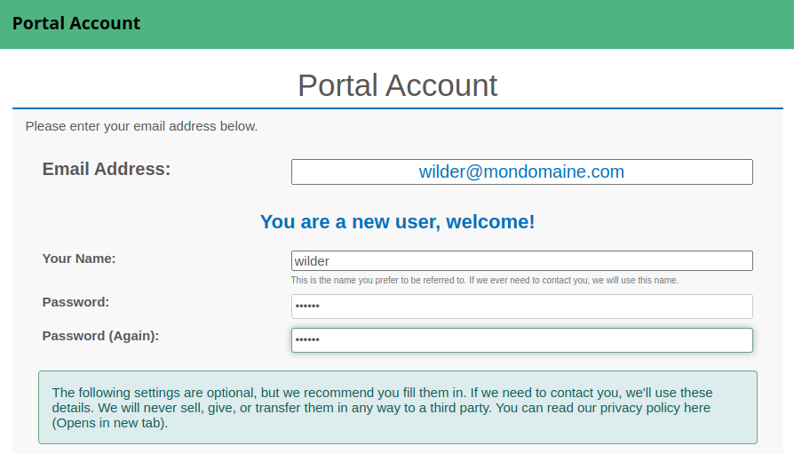

# Installation et configuration d'un serveur VOIP
## Création d'une VM FreePBX
### Prérequis
- L'image iso "SNG7-PBX16-64bit-2302-1.iso"
- Une carte réseau en bridge
- Une IP en 10.15.200.70
### Installation
1. Au démarrage de la VM, dans la liste, choisir la version recommandée
2. Puis sélectionner Graphical Installation - Output to VGA.
3. Enfin choisir FreePBX Standard
4. Pendant l'installation, il faut configurer le mot de passe root (Root password is not set s'affiche).
5. Clique sur ROOT PASSWORD et entre un mot de passe (Le clavier est en anglais donc attention aux lettres des touches du clavier QWERTY).
6. L'installation continue et se termine.
7. Éteindre la VM, enlever l'ISO du lecteur et redémarrer la VM.
## Configuration du serveur 
### Sur le serveur FreePBX
1. Connecte toi en root.
2. Ecrit les lignes de commandes suivantes pour mettre le clavier en français :
```bash
localectl set-locale LANG=fr_FR.utf8
localectl set-keymap fr
localectl set-x11-keymap fr
```
3. Vérifie avec la commande `localectl` :
```
System Locale: LANG=fr_FR.UTF-8
    VC Keymap: fr
   X11 Layout: fr
```
3. Modifier le mot de passe de root avec la commande `passwd root`
### Sur Windows Server22
1. A partir de ton navigateur web, connecte-toi sur l'adresse du serveur et tu arriveras sur l'interface de gestion de FreePBX :
2. Laisse les langages par défaut et clique sur `Submit`
.png)  
3. A la fenêtre d'activation du firewall, clique sur `Abort`
.png)  
4. Tu arrive sur le tableau de bord, clique sur `Apply Config` (en rouge) pour valider tout ce que tu viens de faire
.png)  
5. Va dans le menu Admin puis `System Admin`, un message indique que le système n'est pas activé
.png)  
6. Clique sur Activation puis Activate. Dans la fenêtre qui s'affiche, clique sur Activate
.png)  
7. Entre une adresse email et un mot de passe
  
8. Dans la fenêtre qui s'affiche, renseigne les différentes informations, et pour `Which best describes you` mets `I use your products and services with my Business(s) and do not want to resell it`
Pour `Do you agree to receive product and marketing emails from Sangoma ?` coche `No`
Clique sur `Create` 
.png)  
9. 
.png)  
.png)  
