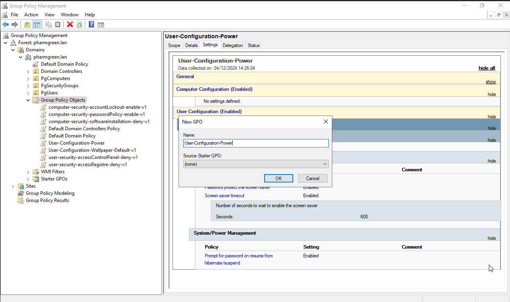
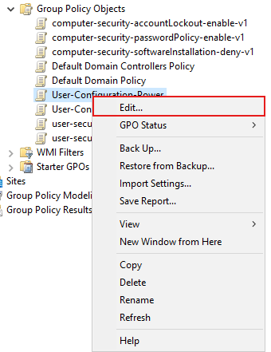
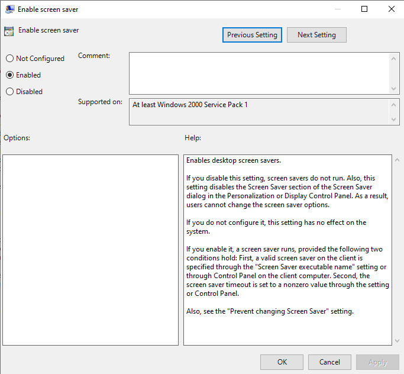
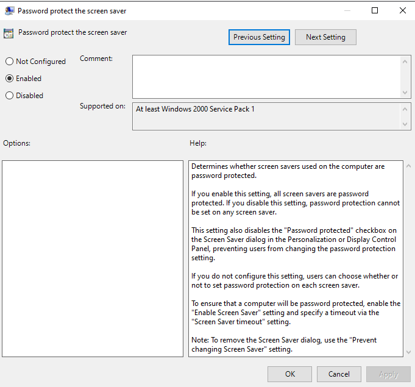
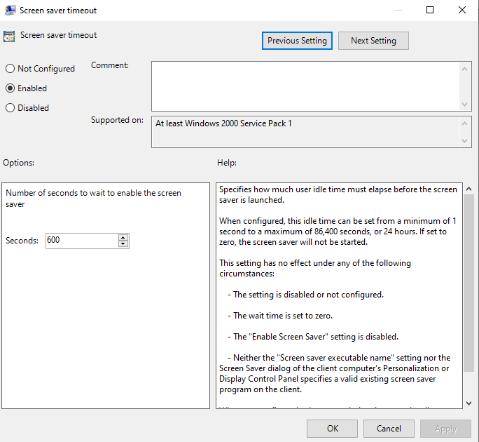
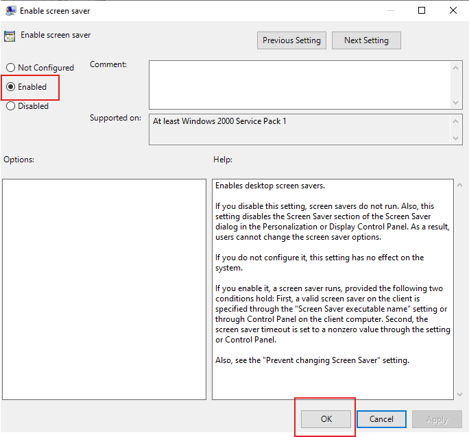
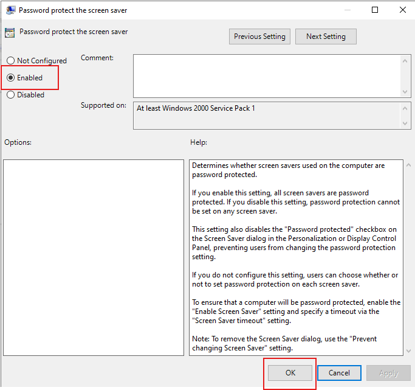
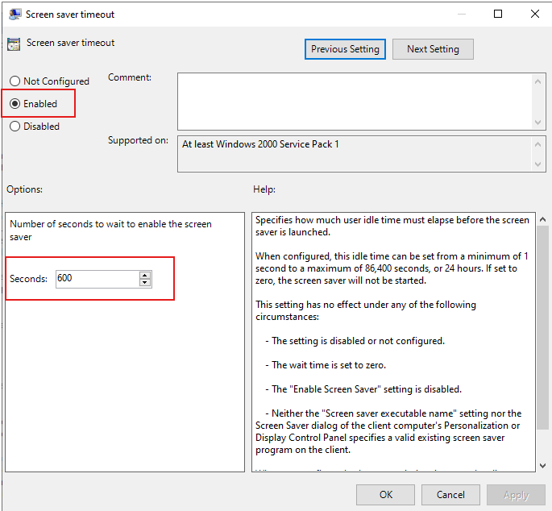
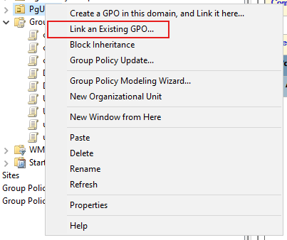
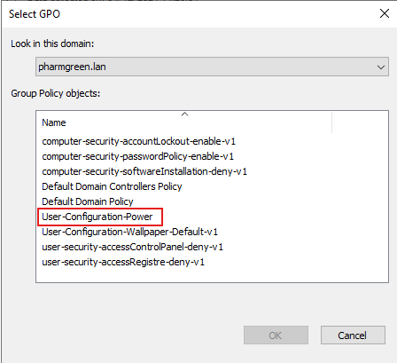

# Mise en place des GPO
## GPO sécurité
1. Politique de mot de passe
2. Verrouillage de compte
3. Verrouillage de compte
4. Blocage de l'accès à la base de registre
5. Blocage complet ou partiel au panneau de configuration
6. Restriction des périphériques amovible
7. Gestion d'un compte du domaine qui est administrateur local des machines
8. Gestion du pare-feu
9. Écran de veille avec mot de passe en sortie
10. Limitation des tentatives d'élévation de privilèges
11. Politique de sécurité PowerShell
## GPO standard
### 1. Fond d'écran

### 2. Mappage de lecteurs

### 3. Gestion de l'alimentation
#### verrouillage automatique des sessions
Afin d'intégrer le GPO du verrouillage automatique des sessions, nous allons dans le group Policy Management.  
Sur le dossier **Group Policy Objects** , click droit et selectionner **New**  
  
Entrer le nom du GPO: **User-Configuration-Power**  
  
Click droit sur le GPO et selectionner **Edit...**  
  
Une nouvelle fenetre nommer **Group Policy Management Editor** s'ouvrira  
  
Il faudra selectionner 3 éléments: 
- Enable screen saver  
  
- Password protect the screen saver  
  
- Screen saver timeout  
  
Pour le **Enable screen saver** et **Password protect the screen saver**, il faut cocher le **Enable** pour l'activer puis enregistrer les modifications.  
  
  
Et pour le **Screen saver timeout**,  il faut cocher le **Enable** pour l'activer puis entrer le temps avant que l'écran se mette en veille, par exemple dans notre cas on a mis 600 seconde (10 minutes) puis on enregistre les modifications.
  
Fermer la fenetre **Group Policy Management Editor** et faite click droit sur le dossier PgUsers et selectionner **Link an Existing GPO**
  
Sur la fenetre **Select GPO**, selectionner le GPO qu'on veut enregistrer: **User-Configuration-Power**
  
Votre GPO de verrouillage automatique des sessions est fait

4. Déploiement (publication) de logiciels
5. Redirection de dossiers (Documents, Bureau, etc.)
6. Configuration des paramètres du navigateur (Firefox ou Chrome)
# Installation de Glpi
# Configuration DHCP
